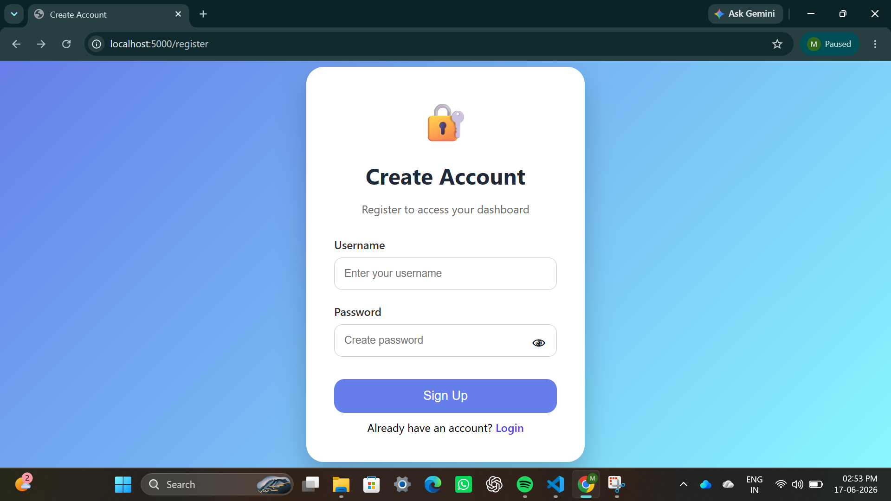
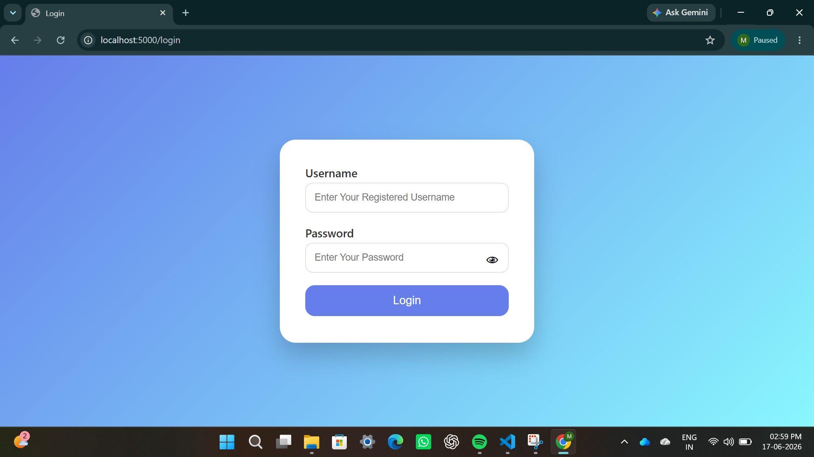
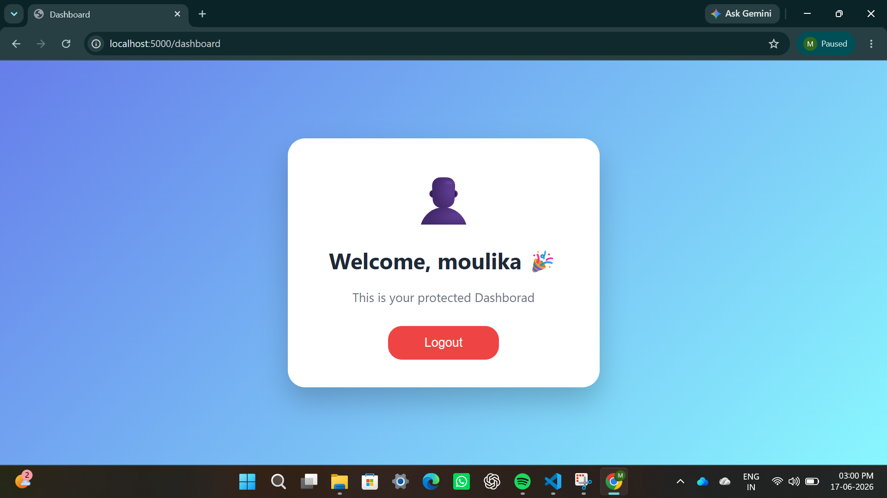

# 🔐 Flask User Authentication System

A full-stack **User Authentication Web Application** built using **Python Flask, SQLite, HTML, CSS, and JavaScript**.

This project was developed as part of my **Python Full Stack Web Development Internship**.  
It demonstrates user registration, secure login authentication, session management, and a protected dashboard.

---

# 🚀 Project Overview

This application allows users to:

- Create a new account
- Store user details securely
- Login using registered credentials
- Access a protected dashboard
- Logout safely

The application uses **Flask sessions** to maintain user login state and **password hashing** to protect user passwords.

---

# ✨ Features

## 👤 User Registration

- New users can create an account
- Username validation
- Duplicate username checking
- Password security validation
- Passwords are encrypted before storing

---

## 🔑 User Login

- User authentication using username and password
- Validates credentials from SQLite database
- Displays error message for invalid credentials
- Redirects users to dashboard after successful login

---

## 🔒 Security Features

- Password hashing using Werkzeug
- Session-based authentication
- Protected dashboard routes
- Secure logout functionality

---

## 📊 Dashboard

- Personalized welcome message
- Displays logged-in user information
- Protected access (only logged-in users can view)
- Professional user interface

---

## 🚪 Logout System

- Custom logout confirmation popup
- Yes/No confirmation before logout
- Clears user session after logout

---

# 🛠️ Technologies Used

## Frontend

- HTML5
- CSS3
- JavaScript

## Backend

- Python
- Flask Framework

## Database

- SQLite

## Security

- Werkzeug Password Hashing
- Flask Session Management

---

# 📂 Project Structure

```text
python-fullstack-task2

│
├── app.py
│
├── database.db
│
├── README.md
│
├── templates
│ │
│ ├── register.html
│ ├── login.html
│ └── dashboard.html
│
│
└── static
|    │
|    ├── register_style.css
|    ├── login_style.cs
```


# ⚙️ Installation & Setup

## 1. Clone the repository

```bash
git clone YOUR_REPOSITORY_LINK
```

## 2. Navigate to project folder
```bash
cd python-fullstack-task2
```

## 3. Create virtual environment
```bash
python -m venv venv
```

## 4. Activate virtual environment
```bash
venv\Scripts\activate
```

## 5. Install required packages
```bash
pip install flask werkzeug
```
## 6. Run the application
```bash
python app.py
```

## 🌐 Application Flow
## Registration Flow

```text
User enters details
        ↓
Validate username
        ↓
Hash password
        ↓
Store in SQLite database
        ↓
Registration successful
        ↓
Login page
```

## Login Flow

```text
User enters credentials
        ↓
Check database
        ↓
Verify hashed password
        ↓
Create session
        ↓
Open dashboard
```

## Logout Flow

```text
Click Logout
        ↓
Confirmation popup
        ↓
Clear session
        ↓
Redirect to login
```

## 📌 Future Improvements
* Email verification
* Forgot password feature
* User profile management
* Password strength indicator
* Deployment using cloud services

## Screenshots

### Register Page



### Login Page



### Dashboard



## Task Demo Video

[Watch Demo Video](demo_video/Demo__video.mp4)

## 👩‍💻 Author

Moulika Tenali

B.Tech Computer Science Engineering Student